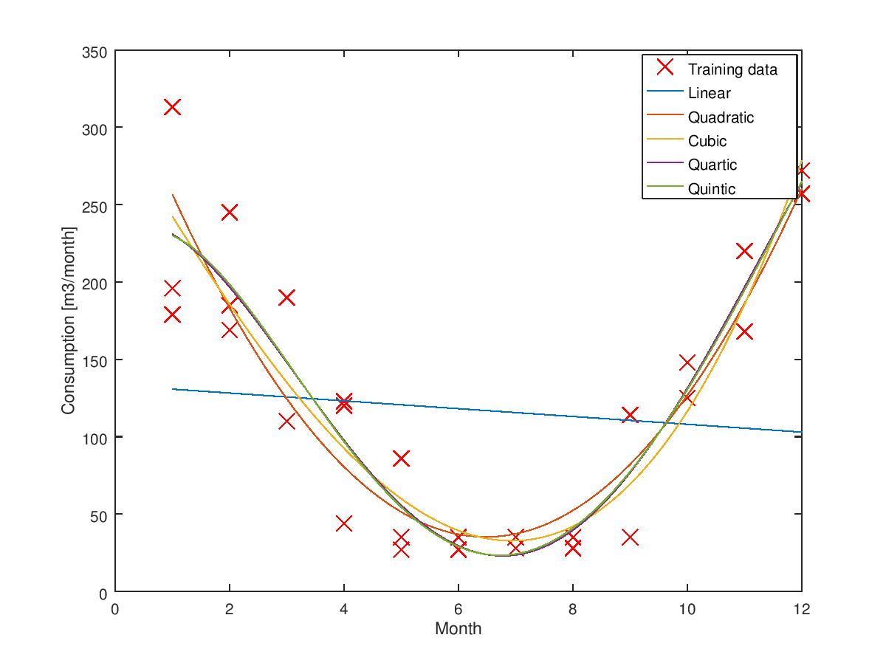
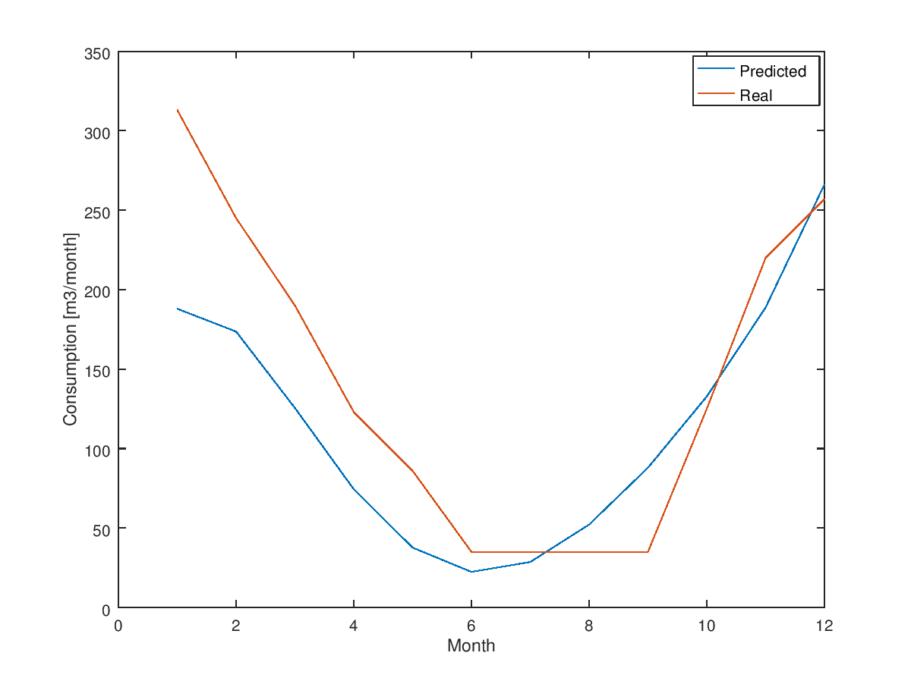

# Gas consumption forecast
Attempt to use Machine Learning to predict natural gas consumption for domestic needs like heating and cooking.
As a training data I used my [historical values](data/data_month.txt). 

* Prediction method: Polynomial Regression
* Optimization: [Normal Equation](https://en.wikipedia.org/wiki/Linear_least_squares_(mathematics))

## Note
- *Written only for educational purposes*
- *Intentionally written in pure Matlab language, using only basic mathematics operations*

### Models

### Training efficiency

### Requirements
* [Octave](https://www.gnu.org/software/octave)
